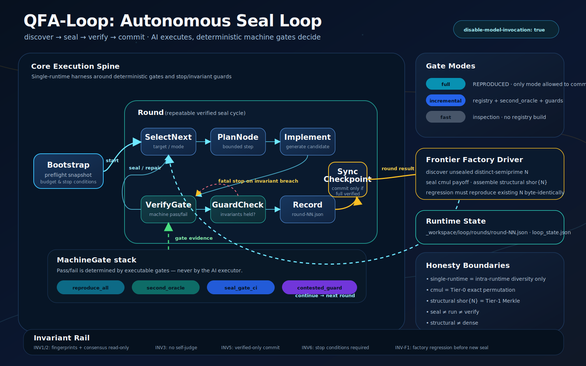

# QuantaFoundry

**An AI-native quantum software foundry.** It generates quantum modules from high-level intent,
verifies them with a **deterministic contract oracle**, seals only proven outputs, and composes
sealed modules into larger quantum applications — with **no human-asserted answer keys** anywhere
in the trust chain.

```text
AI generates.
Oracle verifies (deterministically).
Registry remembers only sealed modules.
Skills reuse successful generation patterns.
```

The trust comes not from the AI's judgement but from **deterministic gates + tamper-evident seals**.

---

## Status

- **77 sealed modules · 166 sealed applications** · registry root `a0b4f678…`
  (live counts are authoritative in [`registry/REGISTRY-MANIFEST.json`](registry/REGISTRY-MANIFEST.json)).
- Verification core is public as **QPGF** → https://github.com/sadpig70/QPGF (157 self-tests green).
- Pure non-destructive growth: every prior seal, the 23 frozen consensus keys, and the oracle
  fingerprint files reproduce **byte-identically**.

### Verify it yourself

```bash
python scripts/reproduce_all.py
# expect: REPRODUCED · root_hash a0b4f678… · second_oracle 71/71 · behavior pass
```

---

## What's real

- **Sealed library**: Bell/GHZ, QFT(2–8), QPE, Grover & amplitude amplification/estimation,
  Trotter/Suzuki Hamiltonian simulation, VQE/QAOA, query algorithms (DJ/BV/Simon), QEC stabilizer
  encoders + transversal logical gates.
- **Shor period-finding** that factors 15 = 3×5 and **genuinely 21 = 3×7**, up to a distinct-prime
  structural frontier (`shor91 … shor3683`, sealed via a `c8x→c12x` multi-control ladder).
- **Key-free cross-model establishment**: the first *live* cross-model truth (`sx` = √X) settled by
  six distinct runtimes + an algebraic proof — no answer key.
- **Autonomous loop** (`qfa-loop` skill): discover → seal → verify → commit, gated end-to-end by the
  deterministic oracle. A **parametric frontier factory** seals arbitrary distinct-semiprime Shor
  apps, regression-gated against existing seals (byte-identical).
- **Adoption/hardening**: OpenQASM3 export/ingest (round-trip unitary identity), a `qf` CLI, a citable
  registry root, convention-independence audit, oracle-revocation + ed25519 Sybil defense.

## Honest boundaries (no overclaim)

- **seal ≠ run ≠ verify**, **approximation ≠ exact**, **structural ≠ dense**.
- **`REPRODUCED` ≠ correct**: one-command reproduction proves byte-identical *determinism*, not
  correctness. Correctness comes from the oracle's independent checks (C1–C4, a second dense oracle,
  and the subspace/resource witnesses) — not from the fact that a run reproduces.
- Modules + most apps are `unitary_equiv` (exact). `ghz16` is `unitary_equiv_sampled`. The large Shor
  apps (15–20 qubits) stay Tier-1 (dense infeasible), but their **modexp core is now
  `subspace_permutation_verified`** — exact permutation on the computational basis by *independent*
  integer arithmetic (path A = circuit-gate permutation vs path B = `w·a^c mod N`), with adversarial
  teeth. This is a real strengthening over bare Merkle structure, yet **still weaker than full dense
  unitary equivalence** (H·iQFT are excluded); period/factor readout stays illustrative only.
- Authoritative tier split: [`registry/SEMANTIC-GUARANTEES.json`](registry/SEMANTIC-GUARANTEES.json) `headline_split`.

---

## Learn more

| Doc | What |
|---|---|
| [`docs/ARCHITECTURE.md`](docs/ARCHITECTURE.md) | Full architecture, components, trust model, and the milestone narrative |
| [`docs/QuantaFoundry-Technical-Spec.md`](docs/QuantaFoundry-Technical-Spec.md) | Complete technical specification + evidence (for independent design review) |
| [`.pgf/external/REVIEW-REQUEST.md`](.pgf/external/REVIEW-REQUEST.md) | Adversarial review request (proposal questions) for external critique |
| [`.agents/skills/qfa-loop/SKILL.md`](.agents/skills/qfa-loop/SKILL.md) | The autonomous seal loop (engine, modes, invariants) |
| [`.agents/skills/qpgf-oracle/SKILL.md`](.agents/skills/qpgf-oracle/SKILL.md) | The deterministic termination oracle (ContractGate) |

### The autonomous seal loop at a glance

[](.agents/skills/qfa-loop/SKILL.md)

`Bootstrap → Round(SelectNext → PlanNode → Implement → VerifyGate → GuardCheck → Record → SyncCheckpoint) → Stop`.
The AI *executes* the loop, but **pass/fail is decided only by executable machine gates** (`VerifyGate`,
`GuardCheck`) — never by the AI — and a round **commits only when fully verified**. See
[`qfa-loop`](.agents/skills/qfa-loop/SKILL.md).

Reproduction artifacts live under `specs/`, `registry/`, and `_workspace/crossmodel/`.

## Non-goals

Not a hardware QPU stack, not a speed-optimized simulator, not a claim of dense verification at
arbitrary scale (large apps are explicitly structural). It is a **trust-first** foundry: correctness
and tamper-evidence over coverage breadth.

## License

See [`LICENSE`](LICENSE) and [`CITATION.cff`](CITATION.cff) (the registry root is citable).
