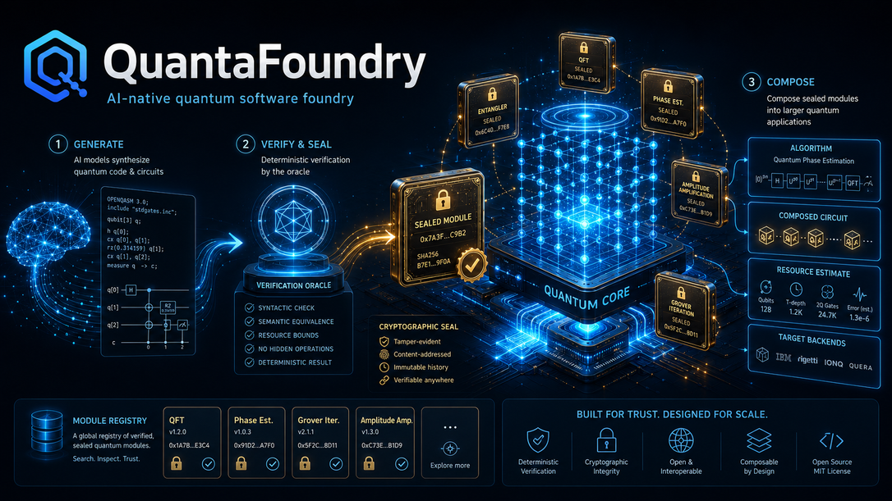
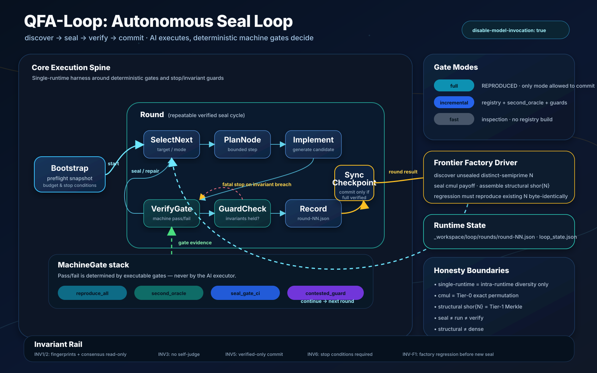

# QuantaFoundry

**An AI-native quantum software foundry.** It generates quantum modules from high-level intent,
verifies them with a **deterministic contract oracle**, seals only proven outputs, and composes
sealed modules into larger quantum applications — with **no human-asserted answer keys** anywhere
in the trust chain.

```text
AI generates.
Oracle verifies (deterministically).
Registry remembers only sealed modules.
Skills reuse successful generation patterns.
```

The trust comes not from the AI's judgement but from **deterministic gates + tamper-evident seals**.

---

## Status

<!-- BEGIN generated:counts src=registry/COUNT-ONTOLOGY.json -->
- **95 sealed modules · 917 unique applications** · registry root `7a394e40720e34dc…`
  (992 app-file entries = 917 unique + 75 cached app-side re-seals;
  live source [`registry/REGISTRY-MANIFEST.json`](registry/REGISTRY-MANIFEST.json)).
<!-- END generated:counts -->
- **10 independent verification paths** ([`docs/VERIFICATION-PATHS.md`](docs/VERIFICATION-PATHS.md)) · 23 frozen consensus keys · **100% classified, 0 orphan** ([quality scorecard](registry/QF-QUALITY-SCORECARD.json)) · verification core public as
  **QPGF** → https://github.com/sadpig70/QPGF.
- **710 of 712 unique apps carry at least one supplementary verification path** beyond the primary seal
  (the 2 exceptions are honestly tiered: `ghz16_structural`, `rm15_tt`); **652 apps are independently
  re-composed** from first-principles module unitaries and match their sealed hash
  ([coverage matrix](registry/VERIFICATION-COVERAGE.json)).
- Pure non-destructive growth: every prior seal, frozen key, and oracle fingerprint reproduces
  **byte-identically**.

## Verify it yourself (one command)

```bash
python scripts/reproduce_all.py
# expect: REPRODUCED · root_hash 0a6fbab08c76… · second_oracle 83/83 · behavior pass
```

`REPRODUCED` proves byte-identical **determinism** — not correctness. Correctness comes from the
oracle's independent checks; the claim-by-claim commands are in
[`docs/EVIDENCE-MAP.md`](docs/EVIDENCE-MAP.md).

**For external reviewers** — audit any claim: [`docs/EVIDENCE-MAP.md`](docs/EVIDENCE-MAP.md) ·
challenge the design: [`docs/QuantaFoundry-Technical-Spec.md`](docs/QuantaFoundry-Technical-Spec.md) §13 ·
falsification requests: [`.pgf/external/REVIEW-REQUEST.md`](.pgf/external/REVIEW-REQUEST.md).

## Use it in 30 seconds (QF-STDLIB)

The sealed registry is consumable as a verified standard library
([v1.0 release](docs/releases/QF-STDLIB-v1.0.md)):

```python
import qf_stdlib

entry = qf_stdlib.lookup("gate/h")          # canonical sealed Hadamard (aliases: h, hadamard)
att   = qf_stdlib.attest("gate/h")          # root-anchored attestation:
# {"claim": {"semantic_guarantee": "unitary_equiv", "tier": 0, ...},
#  "subject": {"u_hash": "0d6a0b7a…"}, ...}  — anchored to the registry root above
```

CLI (each is a separate subcommand, not a pipe):

```bash
python scripts/qf_stdlib.py categories       # list Canon categories
python scripts/qf_stdlib.py lookup gate/h    # resolve a Canon entry
python scripts/qf_stdlib.py attest gate/h    # print its root-anchored attestation
```

See [`docs/QF-STDLIB.md`](docs/QF-STDLIB.md).

## What you can trust, at which grade

| Grade | What it means | Where |
|---|---|---|
| `unitary_equiv` (Tier-0/2) | exact unitary equality vs an independent golden (dense or Clifford tableau) | 95 modules + 542 app entries |
| `unitary_equiv_column_exact` | **full unitary** verified column-by-column vs the Shor spectral formula (float-atol grade, *not* ring-exact) | 30 large Shor apps (n≤18) |
| `compositionally_verified` | exhaustive modexp permutation + ring-exact iQFT, composed (n≥19 Shor) | shor1285/3683 (2 apps) |
| ε-certified (orthogonal axis) | symbolic-exact **upper bound** on distance to the target `e^{-iHt}` | 9 Trotter/Suzuki apps, [`APPROX-GUARANTEES.json`](registry/APPROX-GUARANTEES.json) |
| observation | exact math witnesses (topology, contextuality, MTC, knots, …) — **not seals** | `.pgf/proofs/*-OBSERVE.json` |

Authoritative split: [`registry/SEMANTIC-GUARANTEES.json`](registry/SEMANTIC-GUARANTEES.json) `headline_split`.

**Honest boundaries (no overclaim)** — the project's core discipline
(full page: [`docs/HONESTY-BOUNDARIES.md`](docs/HONESTY-BOUNDARIES.md)):
`seal ≠ run ≠ verify` · `approximation ≠ exact` · `structural ≠ dense` · `REPRODUCED ≠ correct` ·
`observation ≠ seal`. Every artifact carries its boundary inline; period/factor readouts of the
large Shor apps stay illustrative only.

## What's inside (short version)

Bell/GHZ → QFT/QPE → Grover/amplitude estimation → **Shor period-finding** (15, 21, and a
30-app distinct-semiprime frontier with full-unitary column verification) → Trotter/Suzuki/VQE/QAOA
→ QEC stabilizer codes (Steane, RM15, BCH d≥5, HGP, concatenated [[25,1,9]], [[8,3,2]] transversal
CCZ) → QSVT → fermionic encodings → non-abelian group Fourier (S₃/D₄/Q₈/B₃) → topological logical
operations, MTC modular data (SU(2)₃/SU(2)₄, Drinfeld double D(S₃)), knot invariants, magic/
contextuality resource certificates → **10 independent verification paths**.

The full dense catalogue with every qualifier: [`docs/SEALED-ASSETS.md`](docs/SEALED-ASSETS.md).

## The autonomous seal loop at a glance

[](.agents/skills/qfa-loop/SKILL.md)

`Bootstrap → Round(SelectNext → PlanNode → Implement → VerifyGate → GuardCheck → Record → SyncCheckpoint) → Stop`.
The AI *executes* the loop, but **pass/fail is decided only by executable machine gates** — never by
the AI — and a round commits only when fully verified. See [`qfa-loop`](.agents/skills/qfa-loop/SKILL.md).

## Learn more

| Doc | What |
|---|---|
| [`docs/EVIDENCE-MAP.md`](docs/EVIDENCE-MAP.md) | **Claim → command → artifact → boundary** table (start here to audit) |
| [`docs/SEALED-ASSETS.md`](docs/SEALED-ASSETS.md) | The full sealed/observed asset catalogue, dense version |
| [`docs/ARCHITECTURE.md`](docs/ARCHITECTURE.md) | Full architecture, components, trust model, milestone narrative |
| [`docs/QuantaFoundry-Technical-Spec.md`](docs/QuantaFoundry-Technical-Spec.md) | Complete technical specification + evidence (for independent review) |
| [`docs/QF-STDLIB.md`](docs/QF-STDLIB.md) | Canonical import and root-anchored attestation layer |
| [`.pgf/external/REVIEW-REQUEST.md`](.pgf/external/REVIEW-REQUEST.md) | Adversarial review request for external critique |
| [`.agents/skills/qpgf-oracle/SKILL.md`](.agents/skills/qpgf-oracle/SKILL.md) | The deterministic termination oracle (ContractGate) |

Reproduction artifacts live under `specs/`, `registry/`, and `_workspace/crossmodel/`.

## Non-goals

Not a hardware QPU stack, not a speed-optimized simulator, not a claim of dense verification at
arbitrary scale (large apps are explicitly structural/column-grade). It is a **trust-first**
foundry: correctness and tamper-evidence over coverage breadth.

## License

See [`LICENSE`](LICENSE) and [`CITATION.cff`](CITATION.cff) (the registry root is citable).
